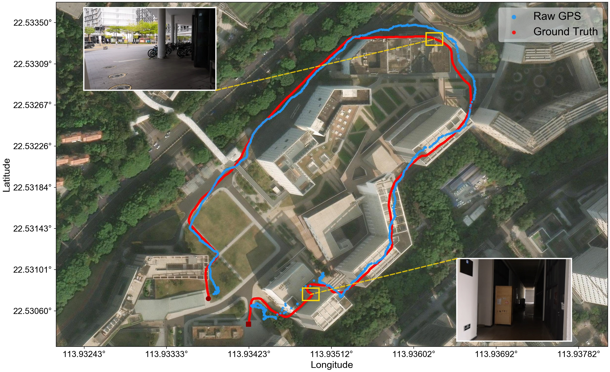
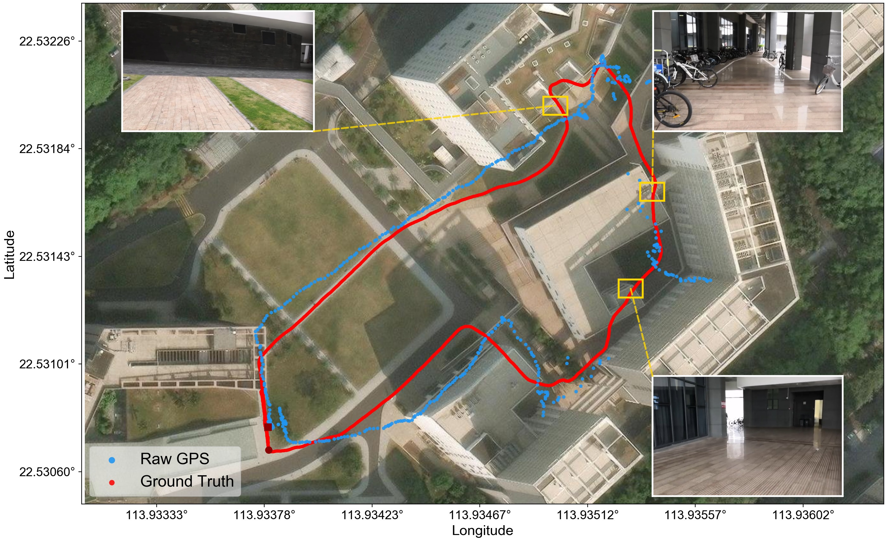
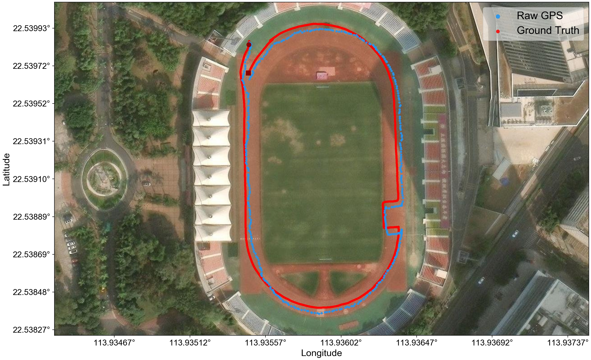
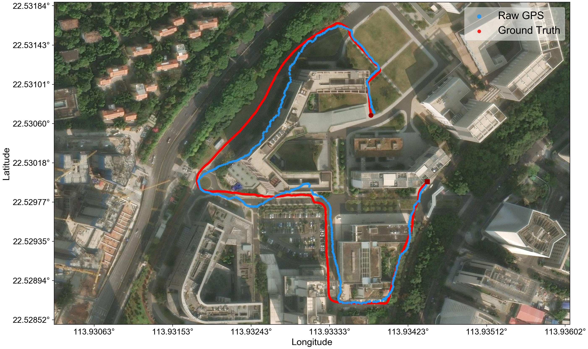
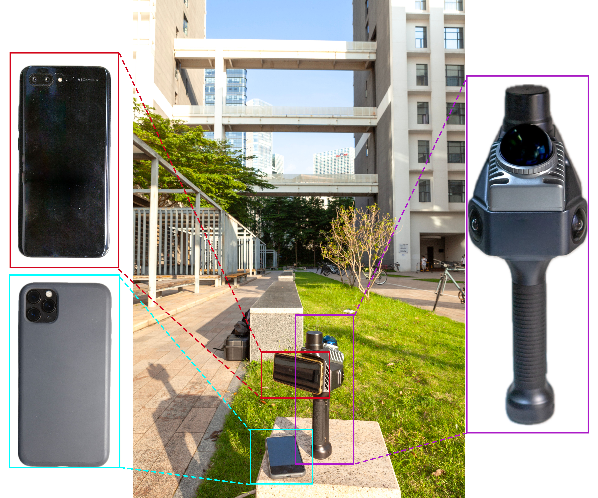

# Mobile-GVIO Dataset

A fine-grained multi-sensor dataset for GNSS-Visual-Inertial fusion evaluation in complex urban environments. Collected from consumer-grade smartphones with a LiDAR-IMU ground truth system.

## Overview

This dataset accompanies the paper **"Mobile-GVIO: A Mobile Devices-Based GNSS-Visual-Inertial Adaptive Fusion Method for Complex Urban Environments"**. It provides synchronized monocular camera images, IMU measurements, consumer-grade GNSS observations, and centimeter-level ground truth trajectories for seven real-world sequences across three environment types.

## Sequences

| Sequence | Environment | Distance | Duration | GNSS |
|----------|------------|----------|----------|------|
| **IO-1** | Indoor-Outdoor | ~1,005 m | ~836 s | Partial |
| **IO-2** | Indoor-Outdoor | ~616 m | ~571 s | Partial |
| **IO-3** | Indoor-Outdoor | ~720 m | ~570 s | Partial |
| **Outdoor-1** | Pure Outdoor | ~501 m | ~394 s | Yes |
| **Outdoor-2** | Pure Outdoor | ~889 m | ~680 s | Yes |
| **Indoor-1** | Pure Indoor | ~137 m | ~149 s | No |
| **Indoor-2** | Pure Indoor | ~91 m | ~91 s | No |

Indoor-outdoor sequences cover indoor corridors, outdoor squares, narrow passages, stationary periods, and environment transitions. Pure outdoor sequences have generally available GNSS with local blockages and multipath. Indoor sequences serve as VIO-only baselines.

### Sample Trajectories

<p align="center">
  
  
  <br><em>Satellite trajectory overlay: IO-1 (left) and IO-2 (right). Ground truth (black), raw GPS (orange), fusion without gating (blue), and Mobile-GVIO (red).</em>
</p>

<p align="center">
  
  
  <br><em>Outdoor-1 (left) and Outdoor-2 (right).</em>
</p>

## Download

The dataset is available at:

> [**Download Link**](https://example.com) *(to be updated)*

Each sequence is packaged as a ROS `.bag` file with its ground truth trajectory. See the [Data Structure](#data-structure) section for details.

## Data Structure

```
├── IO-1/
│   ├── io_1.bag
│   └── ground_truth.txt
├── IO-2/
│   ├── io_2.bag
│   └── ground_truth.txt
├── IO-3/
│   ├── io_3.bag
│   └── ground_truth.txt
├── Outdoor-1/
│   ├── outdoor_1.bag
│   └── ground_truth.txt
├── Outdoor-2/
│   ├── outdoor_2.bag
│   └── ground_truth.txt
├── Indoor-1/
│   ├── indoor_1.bag
│   └── ground_truth.txt
├── Indoor-2/
│   ├── indoor_2.bag
│   └── ground_truth.txt
└── calib/
    ├── cam0_pinhole.yaml
    ├── orbslam3.yaml
    └── vins.yaml
```

## Data Format

### ROS Bag Topics

Each `.bag` file contains three topics:

| Topic | Message Type | Frequency | Description |
|-------|-------------|-----------|-------------|
| `/cam0/image_raw` | `sensor_msgs/Image` | ~30 Hz | Monocular grayscale, 1280×720 |
| `/imu0` | `sensor_msgs/Imu` | ~100 Hz | 6-axis IMU from Honor smartphone |
| `/gnss0` | `sensor_msgs/NavSatFix` | ~1 Hz | WGS-84 fixes from iPhone 11 Pro Max |

Indoor sequences have GNSS data with inflated covariance (>400 m²) or NaN — these should be filtered before use.

### Ground Truth Format

TUM RGB-D trajectory format, generated offline by Fast-LIO2 from a rigidly-mounted handheld LiDAR-IMU system:

```
timestamp tx ty tz qx qy qz qw
```

Example:
```
1774855145.000037432 -1.253475651 -2.933928035 0.756935641 -0.126544081 0.279261305 0.444012057 0.841934090
```

## Sensor Setup

<p align="center">
  
  <br><em>Honor smartphone (red, visual-inertial), iPhone 11 Pro Max (cyan, GNSS), LiDAR-IMU system (purple, ground truth).</em>
</p>

| Component | Device | Role |
|-----------|--------|------|
| Visual-Inertial | Honor smartphone | Camera 1280×720 @ 30 Hz + 100 Hz IMU, rigidly mounted |
| GNSS | iPhone 11 Pro Max | WGS-84 GNSS @ 1 Hz, carried alongside by operator |
| Ground Truth | LiDAR-IMU system | Centimeter-level reference via Fast-LIO2, rigidly mounted |

The Honor smartphone and LiDAR-IMU are rigidly mounted on a stable frame. The iPhone for GNSS is carried simultaneously (in pocket or hand). Temporal synchronization between the two phones is achieved via sharp turning maneuvers at session start/end with offline cross-correlation.

## Calibration

Calibration files are in `calib/`:

| File | Description |
|------|-------------|
| `cam0_pinhole.yaml` | Camera intrinsics (pinhole model, 1280×720) |
| `orbslam3.yaml` | ORB-SLAM3 config with camera-IMU extrinsics and IMU noise |
| `vins.yaml` | VINS-Fusion config with same extrinsics, adapted noise values |

Camera-IMU extrinsics are identical across both configs (Honor smartphone calibration). IMU noise parameters differ by convention — see each framework's documentation.

## Usage

### Playback
```bash
rosbag play IO-1/io_1.bag --clock
```

### Evaluation
```bash
# ATE
evo_ape tum ground_truth.txt estimated.txt --align --plot --plot_mode xy

# RPE (per-meter drift)
evo_rpe tum ground_truth.txt estimated.txt --align --delta 1 --delta_unit m --plot
```

## License

Dataset: [CC BY 4.0](https://creativecommons.org/licenses/by/4.0/) — free to share and adapt with attribution.

## Citation

```bibtex
@article{song2025mobile,
  title   = {Mobile-GVIO: A Mobile Devices-Based GNSS-Visual-Inertial
             Adaptive Fusion Method for Complex Urban Environments},
  author  = {Song, Jiangbo and Hu, Yining and Su, Liang and Li, Jiahao and
             Li, Wanqing and Zhou, Baoding},
  journal = {IEEE Transactions on Instrumentation and Measurement},
  year    = {2025},
  note    = {Under review}
}
```

## Contact

- **Jiangbo Song** — [songjb@szu.edu.cn](mailto:songjb@szu.edu.cn)

Shenzhen University, College of Civil and Transportation Engineering
